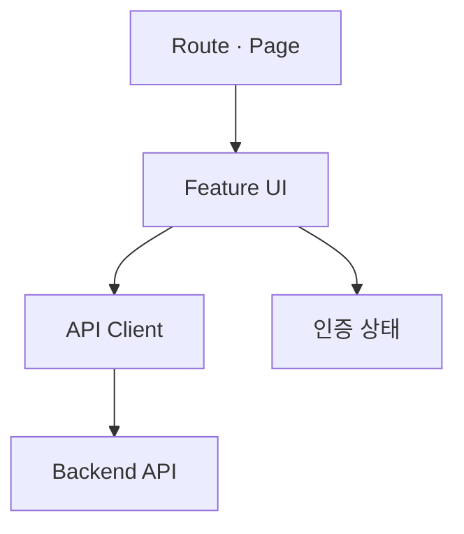

# 로컬스탬프 프론트엔드

지역 행사를 탐색하고 예약·결제, 현장 QR 체크인, 방문 리워드를 이용할 수 있는 웹 애플리케이션입니다.

[조직 소개](https://github.com/Gimhae-Yay) ·
[백엔드](https://github.com/Gimhae-Yay/Regional-Event-Platform-Backend) ·
[API 명세](https://github.com/Gimhae-Yay/Regional-Event-Platform-Backend/blob/dev/docs/api/api-specification.md) ·

---

## 기술 스택

| 구분        | 기술                      | 역할                |
| --------- | ----------------------- | ----------------- |
| Framework | React 19                | 화면과 컴포넌트 구성       |
| Language  | TypeScript              | 타입 안전성 확보         |
| Build     | Vite                    | 개발 서버와 프로덕션 빌드    |
| Routing   | React Router            | 화면 경로와 접근 흐름 관리   |
| Styling   | Tailwind CSS            | UI 스타일링           |
| Test      | Vitest, Testing Library | 컴포넌트·사용자 상호작용 테스트 |
| Payment   | PortOne Browser SDK     | 결제 UI 연동          |
| QR        | qrcode                  | 체크인 QR 표시         |

---

## 빠른 시작

### 요구 사항

- Node.js
- npm

```bash
git clone https://github.com/Gimhae-Yay/local-stamp-front.git
cd local-stamp-front
npm ci
```

환경 변수 설정

```bash
cp .env.example .env
```

개발 서버 실행

```bash
npm run dev
```

---

## 환경변수

| 변수                         | 용도                   | 주의 사항                       |
| -------------------------- | -------------------- | --------------------------- |
| `VITE_API_BASE_URL`        | 배포 환경 API 주소         | 프론트에서 접근 가능한 공개 API URL만 설정 |
| `VITE_API_PROXY_TARGET`    | 로컬 개발 서버의 API 프록시 대상 | 기본값은 로컬 백엔드 주소              |
| `VITE_PORTONE_STORE_ID`    | PortOne 공개 Store ID  | 브라우저에 노출될 수 있는 식별자만 사용      |
| `VITE_PORTONE_CHANNEL_KEY` | PortOne 공개 채널 키      | API Secret을 넣지 않음           |
| `VITE_PORTONE_NOTICE_URL`  | 로컬 터널 웹훅 주소          | 실제 웹훅 수신이 필요할 때만 설정         |

> VITE_로 시작하는 변수는 브라우저 번들에 포함될 수 있습니다.
>
> PortOne API Secret, Webhook Secret, JWT 서명 키 등 비밀값은 절대 넣지 않습니다.

---

## 화면 구성과 사용자 흐름

| 흐름     | 대표 화면                      | 사용자 목적                    |
| --------- | ----------------------------- | ------------------------------ |
| 행사 탐색  | 지역 선택, 행사 목록, 행사 상세 | 원하는 지역과 조건의 행사 확인   |
| 예약·결제  | 좌석 선택, 예약 확인, 결제 결과 | 예약 가능한 좌석 확보와 결제 진행 |
| 내 예약   | 예약 목록, 예약 상세            | 예약 상태와 체크인 정보 확인     |
| 현장 체크인 | QR 표시·스캔 결과             | 현장 방문 확인                  |
| 방문 리워드 | 후기, 스탬프, 미션, 쿠폰      | 방문 기록과 혜택 확인            |
| 운영       | 행사 등록·수정, 체크인        | 행사 운영과 현장 처리            |
| 지역 관리  | 행사 심사·관리                | 지역 정책에 따른 행사 관리       |

---

## 프론트엔드 구조



- Route·Page는 화면 진입과 페이지 조합을 담당합니다.
- Feature UI는 예약, 결제, 체크인 등 사용자 상호작용을 담당합니다.
- API Client는 백엔드 API 요청·응답과 오류 처리를 담당합니다.
- 인증 상태는 화면 접근을 제어하고 사용자 정보를 표시하는 데 사용합니다.
- 예약 확정, 결제 검증, 권한 판정은 백엔드가 최종 책임을 가집니다.

---

## API 연동

- 로컬 개발 시 `/api` 요청은 `VITE_API_PROXY_TARGET`으로 전달합니다.
- 배포 환경에서는 `VITE_API_BASE_URL`을 사용합니다.
- 요청·응답, 오류 코드, 권한 규칙은 백엔드의 [API 명세](https://github.com/Gimhae-Yay/Regional-Event-Platform-Backend/blob/dev/docs/api/api-specification.md)를 단일 기준으로 사용합니다.
- 프론트는 API 오류를 사용자에게 이해할 수 있는 메시지로 표시하되, 서버 오류의 상세 비밀정보는 노출하지 않습니다.

---

## 배포

- 배포 환경 변수는 배포 플랫폼의 Secret 또는 환경변수 설정에서 관리합니다.
- 배포 전에는 `npm run format` -> `npm test` -> `npm run build` 순서로 확인합니다.
